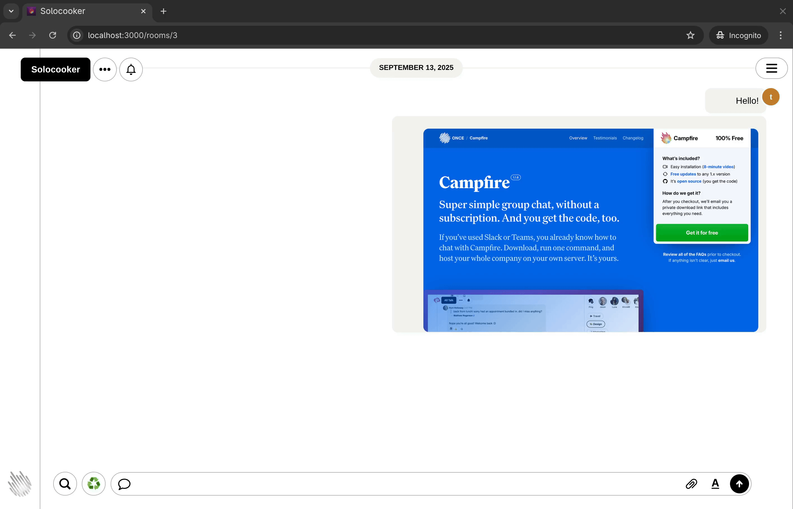

I forked Campfire by @37signals to add some to‑do capabilities and a recycle ♻️ button — published as [Solocooker](https://github.com/chriopter/solocooker).

I like to create disposable notes while working on something and then wrap up by deleting everything that became irrelevant when I found the core of a problem.

