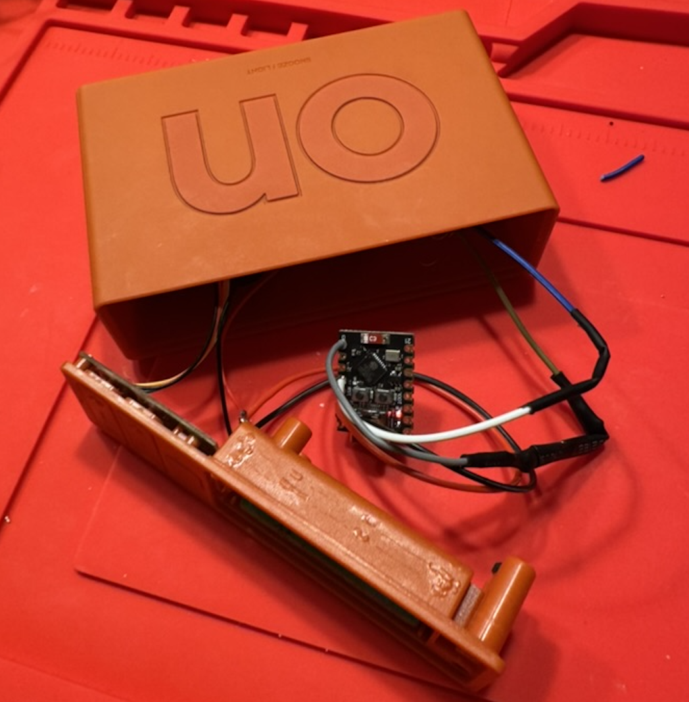
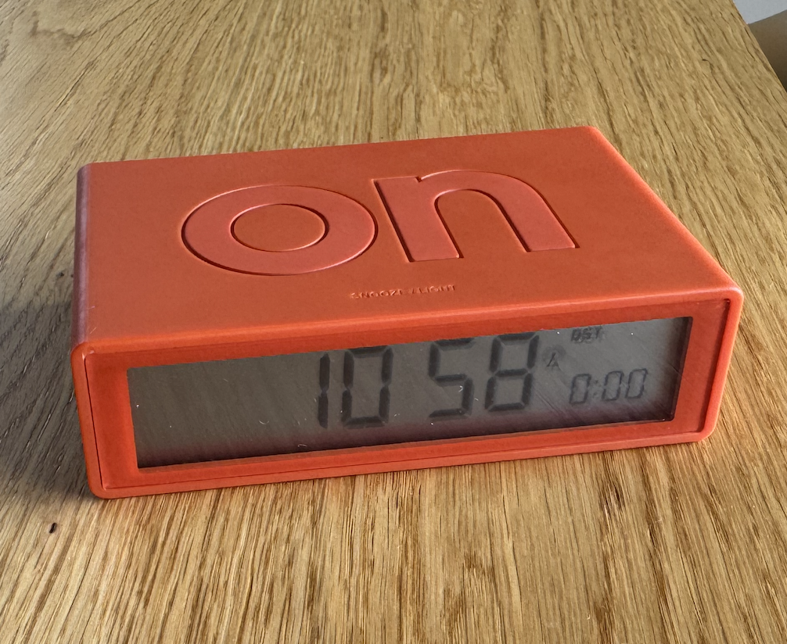
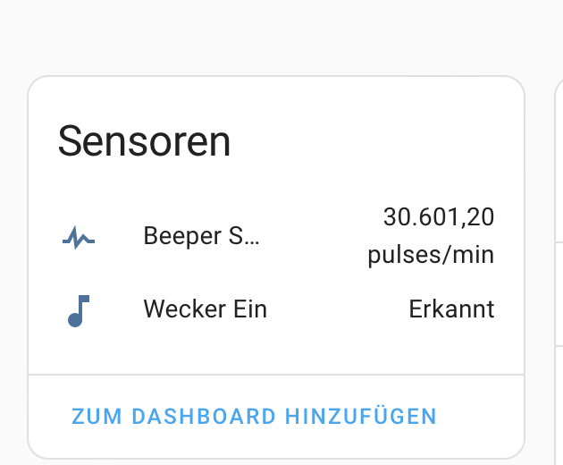

A little project to connect a normal LCD alarm so you can use HA to control blinds, lights, and radio upon alarm activation. Uses ESP32 deep sleep mode to allow battery operation.

Details: [github.com/chriopter…](https://github.com/chriopter/lcd-alarm-clock-smart)
 
<!--more-->
 
