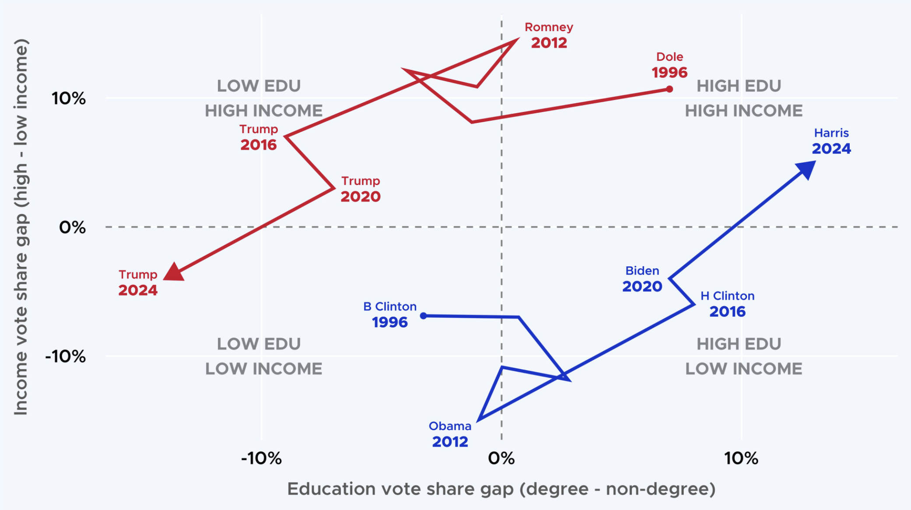
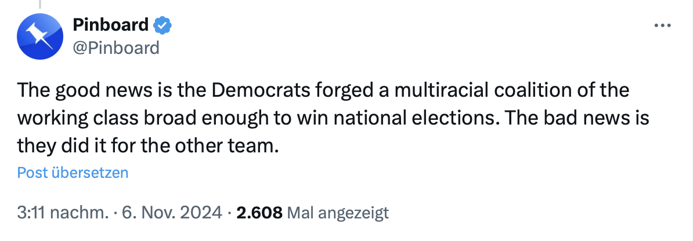

Die Demokraten haben mit Ansage verloren und es scheint als hätte man kein Interesse daran, daraus zu lernen.

Harris Zufriedenheitswerte waren so schlecht, dass Sie in CNN überhaupt nur am Rande Erwähnung fand als man z.B. über die Möglichkeit von Michelle Obama als Präsidentschaftskandidatin nach Biden diskutierte. Währenddessen positionierte sich Harris - wie auch immer - so gut, dass ein völlig ergebnisoffener Prozess ganz schnell auf sie verengt wurde. Die demokratische Legitimierung wurde bei der Nominierung nur noch der Förmlichkeit halber nachgeschoben. Ein Vorgang der jeden Bürger dieser Demokratie mindestens aufhorchen lassen muss; ein schlicht unmöglicher Vorgang.

Doch im DNC scheint alles recht, so lang es die “richtigen” tun. Das Gefühl intellektueller Überlegenheit dient dazu Wahltaktiken zu legitimieren, die jeden mündigen Bürger nur verächtlich vorkommen müssen.

Eindrucksvoll, wie Demokraten ausgerechnet die republikanische Liz Cheney als Vorzeige-Kritikerin von Trump bewerben im glauben, der Souverän würde Cheneys Meinung schon folgen nur weil Sie eine Republikanerin sei.
Beispielhaft und Eindrucksvoll zeigt das ein von Glenn Greenwald geteiltes [Video](https://x.com/ggreenwald/status/1854618074231574555) in dem eine Trump-Unterstützerin wie aus der Pistole geschossen den Namen Cheney mit den Geschäften von Halliburton und den amerikanischen Nah-Ost-Kriegen Anfang der 2000er in Verbindung bringt. Der glaube der “einfache” Wähler sei irgendwie nicht in der Lage die großen Zusammenhänge zu verstehen: Falsch.

Das ist nicht minder als erstaunlich: Die unbedingte Kritik dieser Kriege, Dick Cheney und Verbindungen zu Halliburton war in den 2000ern eine typisch linke progessive Position, oft außerhalb des Mainstreams. Dass nicht nur Trump diese Positionen bedient sondern die Demokraten diese im Fall Chaneys de-facto aufgeben ist mindestens bemerkenswert.

Es zeigt eine herablassende Sicht auf die Wähler als bloße Stimmvieh, dem man ein gewünschtes Narrativ diktieren will. Die amerikanischen Wähler haben aber scheinbar nicht trotz, sondern geraden wegen der immer extremer werdenden Versuche ein völlig angebotsschwaches Wahlangebot von Harris in einen Kulturkampf gut gegen böse zu verwandeln abgelehnt.

Dazu gehört auch eine Abtreibungsdebatte die die Intelligenz der Wähler nur verhöhnen kann:
Staatsrechtler haben über Jahre **indringlich** vor dem Kippen Roe vs. Waden gewarnt. Die Demokraten haben aber bei diesem Thema nicht irgendwie versagt, sie haben es über fast 50 Jahre ja gar nicht erst versucht: Eine Kodifizierung des Abtreibungsrecht auf Bundesebene wurde selbst unter Obama, wo über 2 Jahre beide Kammern demokratisch kontrolliert wurden, nicht einmal im Ansatz diskutiert. Dass man glaubt dem Souverän weiß machen zu können, man hätte mit all dem nichts zu tun erbrachte offensichtlich nicht die gewünschte Mobilisierung.

Das Verlieren der Demokraten ist im Prinzip einfach; eine Vizepräsidentin mit miesen Zufriedenheitswerten, einem inhaltsschwachen Programm bewaffnet sich mit einem Kulturkampf gut gegen böse und lässt sich mit Tiffany-Schmuck auf das Cover der Vogue setzen. Dass das nicht automatisch eine mehrheitsfähige Kandidatin der arbeitenden Mitte sein kann ist eigentlich völlig klar - wäre da nicht Trump, der eine derartige Ablehnung auslöst dass für einige neben ihm alles besser  scheint.
Die Einsicht in diese Realität wird wohl noch etwas auf sich warten lassen.

**Rochade**

Viel interessanter ist aber die Rochade der wählenden Mitte. Es ist schlicht unglaublich was hier passiert:

[Quelle](https://x.com/patrickjfl/status/1854645395856482568/photo/1)

Das Bild der GOP als Partei der Reichen Oberschicht und des DNC als Anwalt der einfachen Amerikaner ist Geschichte. Selbst die Wahlkampfspendenden Milliardäre sind [mehrheitlich beim DNC](https://www.independent.co.uk/news/world/americas/us-politics/trump-harris-campaign-donations-billionaires-b2641096.html). Ob es uns gefällt oder nicht - das ist schlicht eine völlig neue Zeit:

[Link](https://x.com/Pinboard/status/1854164597600657506)

Und so ist für mich schlicht unglaublich welche Themen das Trump-Team derzeit bearbeitet und in kurzen Videos zusammenfasst. Es sind Themen die in den 2000ern und 2010ern originär von progressiven Schichten vorgetragen wurden und die selbst damals selbst in einer demokratischen Partei am Establishment vorbei nicht mehrheitsfähig waren:
Die Reformierung der [FISA-Geheimgerichte](https://x.com/CollinRugg/status/1854716187512651808), ein in der Gesundheit begründeter [Frontalangriff auf die Lebensmittelindustrie](https://x.com/webdevMason/status/1854966497187446824), Forderungen nach [Digital Bill of Rights](https://x.com/MatthewMcD207/status/1854981864391688643) und das Vorgehen gegen Online-Zensur.

Eine republikanische Regierung, die Lebensmittelkonzerne angreift und die Überwachung der Bürger ablehnt? Wären diese Ankündigungen nicht von Trump und seinem Team vorgetragen, könnten sie auch als hoffnungsschürfendes DVD-Extra eines Michael Moore Films durchgehen.

Trumps “Lösungen” dieser Probleme sind aber ganz sicher nicht aus progressiver Sphäre, da reicht schon ein Blick auf die Forderung die Todesstrafe für Drogenhändler und Menschenhändler zu ermöglichen. Ob das überhaupt passiert, wie das kleingedruckte aussieht und welche Punkte verschwiegen werden wird uns noch schwer beschäftigen, keine Frage.

Viele der Themen sind tatsächlich die des kleinen Mannes, der normalen Mittelschicht - damit hatten progressive vor 20 Jahren recht und das ändert sich nicht dadurch, dass jemand anderes diese Themen besetzt.
Das zu lesen wird uns hier nicht schmecken: Trump ist nicht der wahrgenommene “Drain-the-swamp” Kandidat für eine kleine extreme Randgruppe Gruppe - er ist der Anti-Establishment Kandidat der Mitte. (Was nicht heißt, dass er nicht ein neues Establishment, eine neue Elite in ihre Position hieft.)

Team Trump nimmt keine Rücksicht auf bisherige Gepflogenheiten. Wenn Trump diese populären Forderungen und Probleme der Mitte in seinem Exekutiv-Stil löst wird es bis auf weiteres kein zurück mehr geben zu dem politischen System und den Gepflogenheiten von heute. Im guten wie im schlechten.

Entscheidend ist, ob der DNC den Wählern endlich echte Lösungen bietet oder sich weiterhin im Selbstmitleid verliert. Im letzten Fall können sie ihren Laden gleich dichtmachen.

Analogien zu europäischen linken und sozialdemokratischen Parteien liegen auf der Hand.
