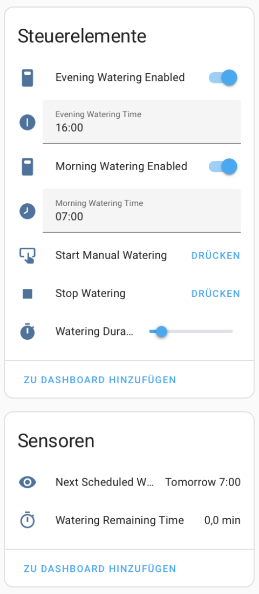

[Smart Watering Pump](https://github.com/chriopter/esphome-water-plants/)

A small ESP8266 relais with programmed times for a water pump that allows to automatically water plants from a tank (USB).

